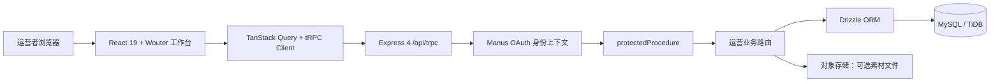

# 平行世界 · 小红书 Skill 内容运营工作台

> 面向小红书 **Skill 创作赛道** 的内容运营管理平台。它将账号策略、选题、内容生产、人工发布协同与数据复盘收束到同一工作台，并坚持**不通过非官方方式直接操作小红书账号**。

「平行世界」服务希望提升工作与创作效率的自媒体人与科技工作者。首版覆盖办公效率、视频创作、音乐创作、绘画与视觉、AI 生图与创意工作流等主题，并采用「赤陶编辑部」的体验基调：深墨侧栏、暖白工作面和克制的赤陶强调色共同形成具备编辑台气质的内部运营环境。

## 界面预览

### 运营总览


运营总览聚合本周选题储备、待审核、待发布、累计涨粉及内容阶段分布。所有指标均来自已登录用户的业务数据；当没有人工登记的发布结果或复盘数据时，页面展示清晰的空状态，而不会生成或伪造运营数据。

### Skill 内容库


内容库用于维护账号定位、目标受众、内容承诺、表达边界和长期主题。运营者可以先将灵感存入选题池，再在内容生产页推进为草稿或待审核内容。

## 产品范围

平台以内容生命周期为中心设计，而非以自动化代替人类判断。内容状态包含 `idea`、`draft`、`review`、`scheduled` 和 `published`，其中排期和发布是独立的人工协同步骤。

| 工作区 | 核心能力 | 当前边界 |
| --- | --- | --- |
| 运营总览 | 聚合选题储备、内容阶段、待审核、待发布与复盘指标。 | 仅汇总已保存的用户数据。 |
| Skill 内容库 | 维护账号策略、目标受众、技能主题和选题灵感。 | 主题创建会在浏览器端检查必填字段。 |
| 内容生产 | 编辑标题、Brief、正文、标签、封面要点、素材备注与审核意见。 | 编辑器只能维护选题池、草稿和待审核状态。 |
| 发布日历 | 按日期组织排期、发布前检查与人工发布结果。 | 不直接控制或登录小红书账号。 |
| 运营复盘 | 人工录入曝光、互动、收藏、分享和涨粉数据，并按内容主题、类型比较表现。 | 不抓取或伪造平台指标。 |

## 业务方案

平台将运营闭环拆成**策略层、内容层、协同层、复盘层**。策略层解决“账号为什么被关注”；内容层将想法变为可编辑资产；协同层在公开发布之前保留人的审核与发布决策；复盘层再把已人工登记的数据反馈给下一轮选题。该设计既适用于稳定的内容生产节奏，也避免了对第三方平台账号进行不透明操作。

| 阶段 | 输入 | 平台处理 | 输出 |
| --- | --- | --- | --- |
| 策略沉淀 | 账号名称、定位、目标受众、内容承诺与表达边界。 | 保存一份按用户隔离的策略档案。 | 可复用的账号定位卡。 |
| 选题储备 | 灵感、主题、内容类型与 Brief。 | 创建 `idea` 内容记录。 | 可进入生产的选题池。 |
| 内容生产 | 标题、正文、标签、封面和素材信息。 | 在 `idea`、`draft`、`review` 之间推进。 | 可审核的完整笔记资料。 |
| 发布协同 | 发布日期、检查清单、人工发布结果与链接。 | 专用接口登记 `scheduled` 与 `published`。 | 清晰、可追溯的人工发布记录。 |
| 数据复盘 | 曝光、赞、评、藏、分享和涨粉。 | 校验非负指标并按用户保存。 | 下一轮选题的性能信号。 |

> **状态保护原则：** 内容编辑器不能直接将内容改成“已排期”或“已发布”。只有日历排期和人工发布结果登记能完成这些转换，以避免绕开审核与人工确认。

## 系统架构

项目使用 React 单页应用承载编辑体验，以 Express + tRPC 提供类型安全的业务接口，以 Drizzle ORM 访问 MySQL/TiDB 数据库。身份上下文由 Manus OAuth 提供；所有运营资料通过受保护接口使用当前登录用户的 `userId` 读写，实现业务数据隔离。



| 层次 | 主要文件 | 职责 |
| --- | --- | --- |
| 体验层 | `client/src/pages/*`、`DashboardLayout.tsx` | 五个工作区、加载/错误/空状态和响应式编辑体验。 |
| 路由层 | `client/src/App.tsx` | 注册 `/`、`/library`、`/workflow`、`/calendar` 与 `/analytics`。 |
| 接口层 | `server/routers.ts`、`server/routers/operations.ts` | 将账号策略、主题、内容、发布协同与指标复盘组织为 tRPC 契约。 |
| 访问控制 | `server/_core/trpc.ts`、OAuth 上下文 | `protectedProcedure` 注入当前用户，并隔离业务数据。 |
| 数据层 | `server/db.ts`、`drizzle/schema.ts` | 使用 Drizzle 读写策略、主题、内容与指标表。 |
| 存储层 | `server/storage.ts` | 为后续封面与素材文件提供 S3 存储适配。 |

### 数据模型

系统将策略、主题、内容和复盘数据拆分存储，使主题归因、内容阶段和表现指标能够独立演进。所有业务表均持有 `userId`，数据读取和写入均以当前认证用户为边界。

| 数据表 | 关键字段 | 用途 |
| --- | --- | --- |
| `strategy_profiles` | `accountName`、`positioning`、`targetAudience`、`corePromise`、`brandVoice` | 每个账号一份内容策略档案。 |
| `skill_themes` | `name`、`description`、`audienceNeed` | 长期深耕的 Skill 内容主题。 |
| `content_items` | `themeName`、`contentType`、`status`、正文、封面要点、排期与发布结果 | 从选题至发布的主内容实体。 |
| `performance_metrics` | 曝光、互动、收藏、分享、涨粉、`recordedAt` | 已发布笔记的手工复盘数据。 |

## 技术栈

| 类别 | 选型 |
| --- | --- |
| 前端 | React 19、TypeScript、Vite、Wouter、Tailwind CSS 4、shadcn/ui。 |
| 数据请求 | tRPC 11、TanStack Query、SuperJSON。 |
| 服务端 | Node.js、Express 4、Zod。 |
| 数据库 | MySQL/TiDB、Drizzle ORM、Drizzle Kit。 |
| 身份认证 | Manus OAuth 与受保护 tRPC 过程。 |
| 测试 | Vitest；覆盖运营指标、登出、内容状态流和主题表单校验。 |

## 本地开发

运行项目前，请准备 Node.js 22+、pnpm 10+ 和可访问的 MySQL/TiDB 数据库。项目依赖 OAuth 和数据库环境变量；不要将任何真实密钥提交到仓库。

```bash
git clone https://github.com/xiaopengs/AiLife.git
cd AiLife
pnpm install
pnpm dev
```

开发服务器启动后，前端由 Vite 提供，tRPC 接口统一挂载在 `/api/trpc`。在本地或外部环境中需要配置以下类别的变量；托管环境会自动提供对应系统变量。

| 类别 | 必要配置 | 说明 |
| --- | --- | --- |
| 数据库 | `DATABASE_URL` | MySQL/TiDB 连接字符串。 |
| 会话安全 | `JWT_SECRET` | 会话签名密钥，应使用高强度随机值。 |
| OAuth | `VITE_APP_ID`、`OAUTH_SERVER_URL`、`VITE_OAUTH_PORTAL_URL` | 身份认证与回调所需的应用配置。 |
| 平台能力 | `BUILT_IN_FORGE_API_URL`、`BUILT_IN_FORGE_API_KEY` | 仅在使用托管平台能力时由运行环境注入。 |

### 数据库迁移

数据结构的唯一事实来源是 `drizzle/schema.ts`。修改 Schema 后应生成并审阅迁移 SQL，再在目标数据库按环境规范执行，避免以手工改库造成定义漂移。

```bash
# 生成迁移文件并在本地执行迁移
pnpm db:push

# 质量检查
pnpm check
pnpm test
pnpm build
```

## 部署说明

推荐使用项目内置的托管发布流程，因为它已匹配当前的 OAuth、数据库、对象存储和运行时配置。每次发布前应先完成代码审查、测试和检查点保存；随后在项目管理界面点击 **Publish**，并在部署后的域名上完成登录回调验证。

| 步骤 | 执行内容 | 验收点 |
| --- | --- | --- |
| 1. 配置环境 | 在部署环境中安全配置数据库、会话和 OAuth 变量。 | 不提交 `.env`、密钥或 Cookie。 |
| 2. 同步数据库 | 审阅并执行由 Drizzle 生成的迁移。 | Schema 与实际表结构一致。 |
| 3. 运行质量门槛 | 执行 `pnpm check`、`pnpm test` 和 `pnpm build`。 | 类型、测试和生产构建均通过。 |
| 4. 保存版本 | 创建可恢复检查点并核对变更记录。 | 版本可回滚，`CHANGELOG.md` 已更新。 |
| 5. 发布与验证 | 在管理界面发布，使用正常浏览器登录并验证核心页面。 | 不绕过第三方人机验证；不触发非官方账号操作。 |

如需部署到外部 Node.js 托管平台，也应使用 `pnpm build` 构建、`pnpm start` 启动，并显式配置 OAuth 回调地址与上述环境变量。外部托管可能与现有身份认证和平台能力存在兼容性差异；在切换前请先完成预发布环境的登录与数据库迁移验证。

## 质量与合规

当前项目已通过 TypeScript 检查、生产构建和 10 项 Vitest 测试。已认证预览核对记录见 [`docs/verification/authenticated-preview-audit.md`](docs/verification/authenticated-preview-audit.md)，需求、方案和实现变化均记录在 [`CHANGELOG.md`](CHANGELOG.md)。

| 原则 | 实现方式 |
| --- | --- |
| 数据真实性 | 空状态不填充虚构的发布、互动或增长指标。 |
| 小红书账号边界 | 平台仅处理内容资产、人工排期、检查与结果登记。 |
| 权限隔离 | 业务接口以认证用户 `userId` 为边界读写数据。 |
| 状态可追溯 | 排期和发布由专用操作完成，避免编辑器越权状态跳转。 |
| 变更可追溯 | `todo.md` 与 `CHANGELOG.md` 记录需求、方案、验收与实现变化。 |

## 项目结构

```text
.
├── client/
│   └── src/
│       ├── components/       # 工作台布局与 UI 组件
│       ├── pages/            # 总览、内容库、生产、日历、复盘
│       └── lib/              # tRPC 客户端与前端校验逻辑
├── drizzle/
│   ├── schema.ts             # 数据模型单一事实来源
│   └── migrations/           # 数据库迁移
├── server/
│   ├── routers/              # 运营 tRPC 路由
│   ├── db.ts                 # 数据访问层
│   └── _core/                # OAuth、tRPC 与运行时基础设施
├── docs/
│   ├── product/              # UI 与产品方案
│   └── verification/         # 验收与截图素材记录
├── CHANGELOG.md              # 需求、方案与实现变更记录
└── todo.md                   # 可验证的工作清单
```

## 后续迭代方向

后续可以在保持人工发布边界的前提下，逐步增加封面/素材版本管理、审核负责人和截止时间、复盘趋势可视化、以及基于既有内容资产的选题辅助。任何外部平台的正式集成均应在确认官方授权能力、数据使用规则与凭据保护方案后单独评估。
