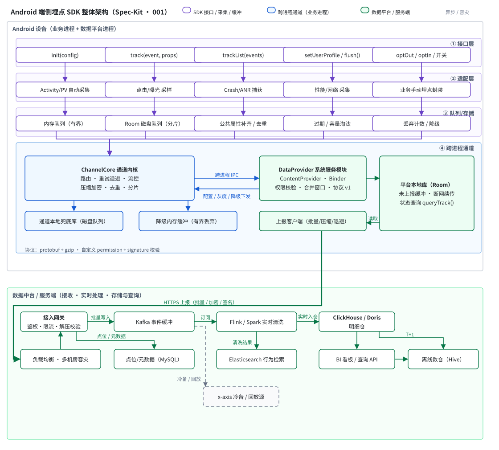

# Android 端侧埋点 SDK + 端侧数据中台 · 设计方案（Spec-Kit）

> 本目录是 `specs/001-android-track-sdk` 的独立交付副本，按 spec-kit 流程产出。
> 核心口径：**数据中台 = 端侧的系统数据服务**（数据平台进程内常驻），负责统一接收、端侧处理、本地存储与向云侧上报；云侧仅作为上报目标与接口约定。

## 文档导航

| 文件 | 说明 |
| --- | --- |
| [constitution.md](constitution.md) | 项目宪法：端侧优先、数据完整性、业务进程不受影响等 7 项原则 |
| [spec.md](spec.md) | 规格说明书：概念界定 + US1–US6 用户故事 + E1–E12 边界情况 |
| [plan.md](plan.md) | 技术方案：全端侧 Java 技术栈、9 项设计决策、数据模型、通道时序 |
| [api.md](api.md) | 契约与接口：SDK API / DataProvider / queryTrack / 云侧接口约定 |
| [tasks.md](tasks.md) | 任务拆解：7 阶段 30 项任务（含验证方式与里程碑） |
| [analyze.md](analyze.md) | 一致性核查：概念一致性 + 覆盖矩阵 + 宪法/图纸核查 |
| [review.md](review.md) | Alibaba Open Code Review 三维审查、修复、构建与测试验证报告 |
| [architecture.svg](architecture.svg) | 整体架构图（矢量交付版） |
| [architecture.drawio](architecture.drawio) | 架构图 draw.io 源文件（与 SVG 坐标 1:1，可继续编辑） |
| [gen_arch_diagram.py](gen_arch_diagram.py) | 图纸生成脚本（同一数据源产出 SVG + drawio） |

## 架构总览

**Android 设备内**

- 业务进程（宿主 App，可多进程接入）：SDK 四层 —— 接口层 `AilifeTrack` → 适配层（自动/手动采集）→ 队列/存储层（内存队列 + Room 磁盘兜底）→ ChannelCore 跨进程通道
- 数据平台进程 · 端侧数据中台（常驻系统数据服务）：DataProvider 统一接入（Binder，签名+权限校验，四值结果码）→ 端侧处理引擎（校验→去重→合并→采样→补齐→会话）→ 端侧统一存储（Room 按天分区，TTL/配额）→ 上报调度器 + 云侧上报客户端（Wi-Fi 实时/蜂窝批量/断网续传），旁路端侧自监控降级控制与本地查询 `queryTrack()`

**云侧（仅接口约定，非本期实现范围）**：接收网关、配置中心、数据服务

## 稳定性设计要点

- 双进程「先落盘后传输」+ dedupKey 幂等去重 → 端内全链路至少一次、任一进程被杀零丢失
- 异常分类处置：指数退避重连（1s→30s ±20% 抖动）、令牌桶流控、健康度 < 0.6 降级为仅缓存、恢复后 1/4→1/2→全量渐进放量
- 丢弃仅允许三类且全部计数：TTL 3 天、配额 20MB、超大事件 > 1MB
